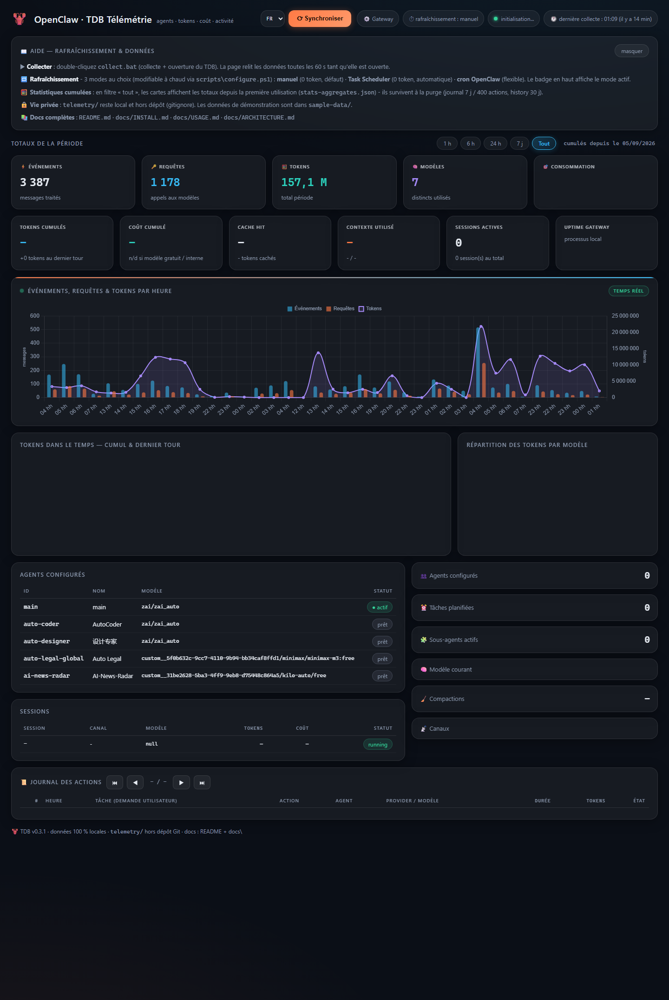

<div align="center">

# 🦞 TDB — Tableau de bord de télémétrie OpenClaw

<div align="center">

[](README.md)
[](README.en.md)

</div>

**Tableau de bord HTML auto-alimenté pour OpenClaw — tokens, coût, cache, agents, journal des actions**




*Un seul fichier HTML · un script PowerShell déterministe · vos données restent sur votre machine*

</div>

---

## Fonctionnalités

- **Bouton ⟳ Synchroniser + panneau d'aide** en haut de la page (l'aide est repliable)
- **Cartes de totaux** avec filtre de période : 1 h / 6 h / 24 h / 7 j / tout
- **3 modes de rafraîchissement au choix** : manuel (défaut, 0 token),
  Task Scheduler Windows (0 token, auto), cron OpenClaw — modifiable à chaud
- **KPI session** : tokens cumulés, coût, cache hit, contexte utilisé, sessions actives
- **Graphiques** (Chart.js) : tokens dans le temps, répartition des tokens par modèle,
  événements + requêtes + tokens par heure (historique horaire **immortel**)
- **Journal des actions** paginé (50 par page) : tâche, action/outils appelés,
  agent, provider/modèle, durée, tokens, état de complétion (✅ 🔧 ⛔ ❌)
- **Statistiques cumulées** : les totaux « depuis toujours » survivent à la purge
  des journaux détaillés (`stats-aggregates.json`)
- **Auto-refresh** : relecture des données toutes les 60 s

## Démarrage rapide

```text
1. powershell -File scripts\install.ps1     → installe + demande le mode
2. Double-cliquer collect.bat               → collecte + ouverture du TDB
3. Lire le tableau de bord                  → filtres, graphiques, journal
```

Prérequis détaillés : [docs/INSTALL.md](docs/INSTALL.md) ·
Usage : [docs/USAGE.md](docs/USAGE.md) ·
Fonctionnement interne : [docs/ARCHITECTURE.md](docs/ARCHITECTURE.md)

## Modes de rafraîchissement

| Mode | Déclencheur | Tokens LLM |
|---|---|---|
| `manual` (défaut) | double-clic `collect.bat` | 0 |
| `taskScheduler` | Planificateur Windows | 0 |
| `openclawCron` | cron OpenClaw (peut viser un modèle local Ollama) | ~24k/cycle |

Changement à chaud : `scripts\configure.ps1 -Mode <manual|taskScheduler|openclawCron>`.

## D'où viennent les données ?

- **OpenClaw installé** : `collect.ps1` interroge la CLI OpenClaw
  (`status --json`) et les transcripts de sessions → métriques réelles
- **Sans OpenClaw** : copiez le contenu de [`openclaw-tdb/sample-data/`](openclaw-tdb/sample-data/)
  dans `openclaw-tdb/telemetry/` puis ouvrez `index.html` — le TDB fonctionne
  en mode démonstration

## Vie privée

- Le dossier `openclaw-tdb/telemetry/` (vos données réelles) est **gitignore** :
  rien de personnel ne part dans un dépôt
- `sample-data/` contient des données **fictives** pour la démo
- `config.local.json` (mode + chemins machine-spécifiques) est également gitignore

## Licence

[MIT](LICENSE)
